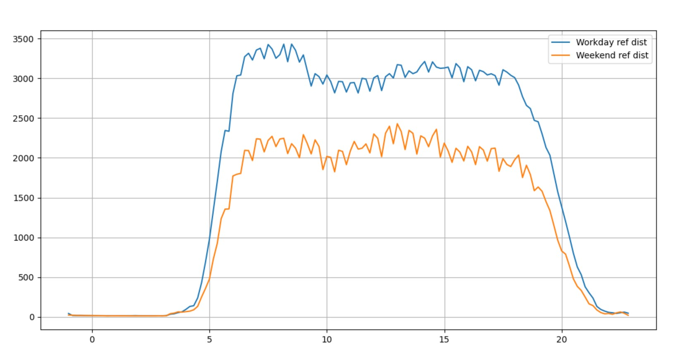
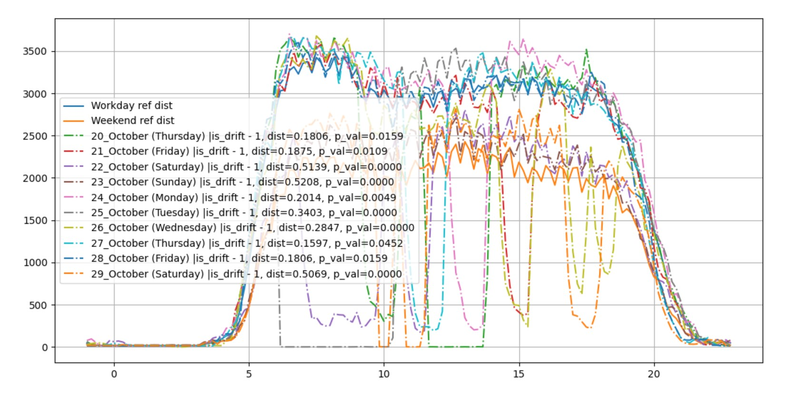
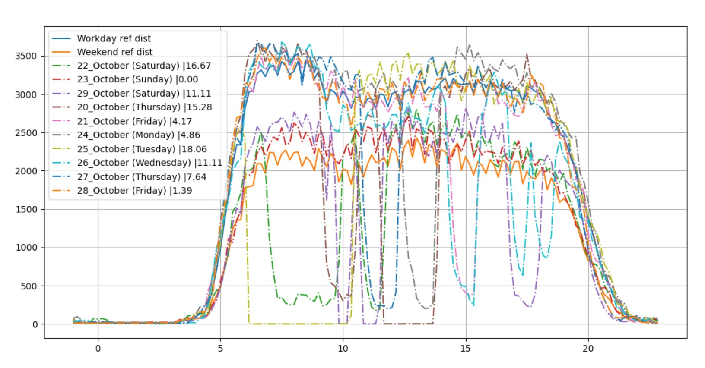

# Drift detection algorithms

My data are tables that contains GPS data of public transport or vehicle location information (VLI).
Each tabel contain records for 1 day.

## Univariate drift detection
For univariate drift detection I've choose number of new records 
in 10 minute intervals. I've use two methods - Kolmogorov-Smirnov test
and bounds base method.

They located in file `univariate_update_frequency.py` functions 
`detect_KS_drift` and `detect_bounded_drift` respectfully.

Visualisation is below. You also can create plot - use code
in `univariate_update_frequency.py` file. 

To calculate referral distribution you can use function `calculate_reference_distribution`
its' inputs is `table_distribution_list` (historical distributions list to calculate
referral distribution on ) and `solving_func` is the function that process input distributions
and output the referral one, by default it is `np.median`. 

**Referral VLI updates distributions**

**Kolmogorov-Smirnov test visualisation**

**Bounds base method visualisation**

